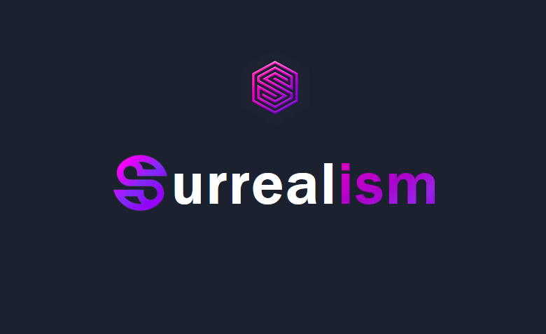

 

# SurrealismUI

- author：syf20020816@outlook.com
- createDate：20230908
- updateDate：20241208
- version：0.5.3
- email：syf20020816@outlook.com
- discord：[Surrealism-UI](https://discord.gg/KSQqrSMCnU)
- book：[SurrealismUI Book](https://surrealism-all.github.io/SurrealismUI.github.io/)



**SurrealismUI is a third-party component library built entirely using Slint**

## Install

### use cargo-generate

#### 1. Install cargo-generate

you can use the following command to install cargo-generate

```bash
cargo install cargo-generate
```

#### 2. generate your own project

**input your project name to replace `{project_name}`**

```bash
cargo generate --git https://github.com/Surrealism-All/surrealism-ui-template.git --name {project_name}
```

```bash
🔧   Destination: E:\Rust\test-surrealism ...
🔧   project-name: test-surrealism ...
🔧   Generating template ...
🔧   Moving generated files into: `E:\Rust\test-surrealism`...
🔧   Initializing a fresh Git repository
✨   Done! New project created E:\Rust\test-surrealism
```

#### 3. run project

```bash
cargo run
```

### Github

1. GoTo ：https://github.com/Surrealism-All/SurrealismUI/releases
2. Find the latest release and download
3. unzip and add into your project

## QuickStart

### Config SurrealismUI as Library (optional)

1. Open VsCode and choose Settings , then search `Slint:Library Paths`
2. Choose edit in settings.json
3. Find `slint.libraryPaths` and add `"SurrealismUI":"parent_file_path\\surrealism-ui\\index.slint"`❗

```json
  "slint.libraryPaths": {
    "SurrealismUI":"E:\\test_try\\test-surrealism\\ui\\modules\\surrealism-ui\\index.slint"
  },
```


### Import and Use

```slint
import { SMenu,SCard,SHeader,SIcon,SButton  } from "../index.slint";
import {UseIcons } from "../use/index.slint";
import { STip } from "../src/tip/index.slint";
import { STag } from "../src/tag/index.slint";
import { SAlert } from "../src/alert/index.slint";

export component App inherits Window {
    height: 600px;
    width: 800px;
    private property <int> router-index : 0;
    HorizontalLayout {
      left-wrapper:=Rectangle {
        z: 111;
        height: 100%;
        width: menu.width;
        clip: false;
        menu:=SMenu {
          change(index,data) => {
            debug(index);
          }
        }
      }
      right-wrapper:=Rectangle {
        z: 100;
        width: parent.width - menu.width;
        background: #2b2b32;
        if router-index==0:index-page:= Rectangle {
            height: 100%;
            width: 100%;
            VerticalLayout {
              HorizontalLayout {
                padding: 8px;
                alignment: center;
                Rectangle {
                  height:header.height ;
                  width: parent.width - 16px;
                  header:=SHeader {
                    value: [{label:"SurrealismUI",value:"1"},{label:"menu:Index",value:"2"}];
                  }
                }
              }
              HorizontalLayout {
                padding: 24px;
                alignment: space-around;
                STag {
                  theme: Warning;
                  text: "SurrealismUI V0.3.3";
                }
                STag {
                  theme: Success;
                  text: "MIT License";
                }
                STag {
                  theme: Error;
                  text: "For Slint!";
                }
                STag {
                  theme: Error;
                  text: "author:syf20020816@outlook.com";
                }
              }
              HorizontalLayout {
                alignment: center;
                SCard {
                  card-width: 460px;
                  card-height: 320px;
                  SIcon {
                    height: parent.height;
                    width: parent.width;
                    source: @image-url("../README/imgs/logo.png");
                  }
                }
              }
              HorizontalLayout {
                padding: 24px;
                alignment: space-around;
                SButton {
                  text: "Try SurrealismUI";
                  clicked => {
                    alert.success("Try SurrealismUI!!! Let's GO!");
                  }
                }

                SButton {
                  show-icon: true;
                  icon: UseIcons.icons.Smiling-face;
                  theme: Primary;
                  text: "Star on Github!";
                }
                STip {
                  text: "GO TO SurrealismUI WIKI?\n Click here!";
                  height: wiki-btn.height;
                  width: wiki-btn.width;
                  position: Bottom;
                  wiki-btn:=SButton {
                    theme: Success;
                    text: "Read Wiki!~~~";
                    clicked => {
                      parent.clicked();
                    }
                  }
                }
              }

            }
        }
      }
    }
    alert:=SAlert {
      result-type: Success;
      text: "";
    }
}
```


## What SurrealismUI Do？

```
			  default
————————————————————————————————————
|  logic control layer (Rust|C++)  |
————————————————————————————————————
				⇕
————————————————————————————————————
|    UI layer (write components)   |
————————————————————————————————————

		   SurrealismUI
————————————————————————————————————
|  logic control layer (Rust|C++)  |
————————————————————————————————————
				⇕
————————————————————————————————————
|      UI Styles Wrapper layer     |   <-- What SurrealismUI do , see ①
————————————————————————————————————
|   UI layer (write components)    |
————————————————————————————————————

①：define a lot replaceable theme styles and binding styles use theme property , can be customized in slint file or logic control layer , means: all system components are wrapped (Customizing themes in third-party component libraries is very affordable as it acts on the UI layer. slint is like an integration of HTML and CSS, so I use this way)(By binding global singleton variables to styles, any component that uses variables can change styles simultaneously)

				System support (like iced)
————————————————————————————————————      ————————————————
|           logic control          | -->  | Theme::Light |
————————————————————————————————————      ————————————————
|             UI layer             |     		  ↓
———————————————————————————————————— 	    |————————————|
						 ↑			     ↓            ↓
				import	  ← Light_Theme Styles   Dark_Theme Styles

## Diff
Slint differs from other GUI frameworks in that the UI layer is completed through. slint, which I believe is good and brings many advantages (compatibility with different platforms, instant preview, maintainability, parallel development, etc.). But this also leads to SLIT being unable to easily customize the theme of the component. Theme customization and switching are dynamic to static processes, which require a lot of logical processing, and this is also same as (HTML+CSS+js | ts)
```

## Themes

Built in 7 theme colors in SurrealismUI

### themes-color

<table cellspacing="0" border="0">
      <thead>
        <tr>
            <th>Theme</th>
          <th>weakest</th>
          <th>weaker</th>
          <th>normal</th>
          <th>deeper</th>
          <th>deepest</th>
          <th>font</th>
          <th>opacity</th>
        </tr>
      </thead>
      <tbody>
        <tr style="color:#000">
            <td style="color:#f60;">Light</td>
          <td style="background:#F6F6F6;height:3em">#F6F6F6</td>
           <td style="background:#E0E0E0;height:3em">#E0E0E0</td>
           <td style="background:#FFFFFF;height:3em">#FFFFFF</td>
           <td style="background:#F6F6F6;height:3em">#F6F6F6</td>
           <td style="background:#F5F5F5;height:3em">#F5F5F5</td>
           <td style="background:#212121;height:3em">#212121</td>
           <td style="background:#E0E0E088;height:3em">#E0E0E088</td>
        </tr>
          <tr style="color:#000">
            <td style="color:#f60;">Primary</td>
          <td style="background:#88D0EC;height:3em">#88D0EC</td>
           <td style="background:#6CB8F7;height:3em">#6CB8F7</td>
           <td style="background:#3AA1F5;height:3em">#3AA1F5</td>
           <td style="background:#1891F3;height:3em">#1891F3</td>
           <td style="background:#0B86F1;height:3em">#0B86F1</td>
           <td style="background:#e5ffff;height:3em">#e5ffff</td>
           <td style="background:#3AA1F588;height:3em">#3AA1F588</td>
        </tr>
          <tr style="color:#000">
              <td style="color:#f60;">Success</td>
          <td style="background:#8FCEC4;height:3em">#8FCEC4</td>
           <td style="background:#61BF84;height:3em">#61BF84</td>
           <td style="background:#38A762;height:3em">#38A762</td>
           <td style="background:#21964A;height:3em">#21964A</td>
           <td style="background:#118A3D;height:3em">#118A3D</td>
           <td style="background:#e5fffb;height:3em">#e5fffb</td>
           <td style="background:#38A76288;height:3em">#38A76288</td>
        </tr>
          <tr style="color:#000">
              <td style="color:#f60;">Info</td>
          <td style="background:#F6F6F6;height:3em">#F6F6F6</td>
           <td style="background:#eaeaea;height:3em">#eaeaea</td>
           <td style="background:#E0E0E0;height:3em">#E0E0E0</td>
           <td style="background:#D2D2D2;height:3em">#D2D2D2</td>
           <td style="background:#BDBDBD;height:3em">#BDBDBD</td>
           <td style="background:#484848;height:3em">#484848</td>
           <td style="background:#E0E0E088;height:3em">#E0E0E088</td>
        </tr>
          <tr style="color:#000">
              <td style="color:#f60;">Warning</td>
          <td style="background:#ffd5bd;height:3em">#ffd5bd</td>
           <td style="background:#FCBD99;height:3em">#FCBD99</td>
           <td style="background:#F9A677;height:3em">#F9A677</td>
           <td style="background:#F9955C;height:3em">#F9955C</td>
           <td style="background:#F8894A;height:3em">#F8894A</td>
           <td style="background:#fff4ec;height:3em">#fff4ec</td>
           <td style="background:#F9A67788;height:3em">#F9A67788</td>
        </tr>
          <tr style="color:#000">
              <td style="color:#f60;">Error</td>
          <td style="background:#e9a7a7;height:3em">#e9a7a7</td>
           <td style="background:#f48989;height:3em">#f48989</td>
           <td style="background:#ed5e5e;height:3em">#ed5e5e</td>
           <td style="background:#ed4e4e;height:3em">#ed4e4e</td>
           <td style="background:#ed3b3b;height:3em">#ed3b3b</td>
           <td style="background:#ffe5e4;height:3em">#ffe5e4</td>
           <td style="background:#ed4e4e88;height:3em">#ed4e4e88</td>
        </tr>
          <tr style="color:#fff">
              <td style="color:#f60;">Dark</td>
          <td style="background:#707070;height:3em">#707070</td>
           <td style="background:#616161;height:3em">#616161</td>
           <td style="background:#3a3a3a;height:3em">#3a3a3a</td>
           <td style="background:#242424;height:3em">#242424</td>
           <td style="background:#000000;height:3em">#000000</td>
           <td style="background:#e4e4e4;height:3em">#e4e4e4</td>
           <td style="background:#42424288;height:3em">#42424288</td>
        </tr>
      </tbody>
    </table>


## Wiki

https://github.com/Surrealism-All/SurrealismUI/wiki

## Components

- `SText` ：It is the simplest and most common component in SurrealismUI
- `SButton` ：`SButton` is a button component that you can freely perform regular attribute operations on
- `SIcon` ：this is a icon container , better than Image
- `SInput` ：This is a basic input box, often used in forms, divided into two types: text and password
- `SCard` ：A very simple universal card without any layout or restrictions ， you can add anything you want to the card
- `SStar` ： `SStar` is a scoring component
- `SSelect` ：`SSelect` is a selector that provides three types of optional input parameter values
- `STag` ：A small tag used to display data
- `SHeader` ：`SHeader` is a simple header component that is generated based on routing information
- `STable` ：In fact, it is just the header of the table and needs to be used together with `STableColumn` or `STableColumnFlex`

  - `STableColumn` ：It is table body , it covers the data of the table , It is easy for just show text in Table
  - `STableColumnFlex` ：It is also a kind of table body , but this component is more flexible , you can use with `STableColumnItem` together and define what will show in the table
  - `STableColumnItem` ：It is a component used to describe a cell in a table , It can help you define tables more easily.

- `SCollapse` ：`SCollapse` is a foldable panel. This is the outter of the Collapse, what really works is `SCollapseItem`. The outter only serves as a standard layout , this is a zero cost construction

  - `SCollapseItem` ：`SCollapseItem` is a component of `SCollapse`, without which `SCollapse` will not work , You can customize the components or use the default text display method in it

- `SResult` ：`SResult` helps you easily build a quick prompt , you can build it in popup window
- `SAvatar` ：`SAvatar` is a avatar component that defaults to Icons.Avatar when there are no images available
- `SLink` ：`SLink` is commonly used to represent text connections or sharing
- `SDivider` ：A divider groups sections of content to create visual rhythm and hierarchy. Use dividers along with spacing and headers to organize content in your layout.
- `SPopup` ：A masked pop-up layer appears in the current window . And users will not be able to use the pop-up layer to cover the components under it. Clicking on the pop-up layer again will close it
- `SCollection` ：`SCollection` is an expandable box that can be zoomed in or out by clicking (internal can also be used)
- `SRadio` ：`Radio `let people select a single item
- `SBadge` ：`SBadge` is a quick way to display user status or events
- `SPersona` ：This component is used to display simple user introduction information
- `SProgress` ：`SProgress` is commonly used to display download progress or event processing progress . And you can fully control it through the progress property
- `STip` ：A tip provides supplemental, contextual information elevated near its target component
- `SLoading` ： This is a loading component that you can embed anywhere you want to add a loading animation
- `SDialog` ：`SDialogs` are used to confirm messages or events and display text
- `SMenu` ：`SMenu` is a menu bar located on the left side that you can quickly generate through the menu-data property
- `SSwitch` ：`SSwitch` is a switch used for simple judgment scenarios
- `SDrawer` ：Sometimes, the Dialogue component does not meet our needs , such as your form being too long, or if you need to temporarily display some documents, please use the `SDrawer`
- `SAlert` ：`SAlert` is used to display important prompt information on the page
- `SSwitchGroup` ：`SSwitchGroup` switch group can contain more switch cases
- `STree` ：`STree` can be used to display directory structure, forming a parent-child relationship, and can be easily displayed
- `SFile` ：`SFile` can help users present file selectors GUI
- `STab` ：provide tab functionality, so that users can switch between different content sections
- `SCheckbox` ：`SCheckbox` let people select multi items
- `SPopover` ：A customizable popover component designed to display contextual information or interactive content, attached to an element and floating above the UI. It supports various positions and can be shown or hidden programmatically.
- `SStep` ：The Step component visualizes the progress of a sequence by breaking it down into individual steps. It allows for custom theming and supports indicating the current, completed, and pending steps through visual cues.
- `SKeyBoard` ：A customizable keyboard component for various input types including numbers, alphabets, and computer keyboard layouts.
- `SPagination` ：A component designed for navigating through pages, providing options for customization and various interactions.
- `SCarousel`：The Carousel component is designed to display a sequence of images (or slides) that users can navigate through. It provides a dynamic and visually engaging way to showcase multiple images without occupying too much space on the screen.
- `STimeLine`：The timeline component is mainly used to display the changes of data over time, and it is usually used in data visualization to visually represent time series data
- `SNumberInput`：A numeric input component that inherits from SCard, designed for inputting numerical values within a specified range. It allows adjustments through increment and decrement actions.
- `SCalendar`：A calendar component that inherits from SCard. It is designed to display a month view with the ability to navigate and select dates.
- `STabbar`: provide bottom operation bar for page switching
- `SSlider`: The Slider component is used for creating a slider control that allows users to select a value within a range. It supports customization of orientation, theme, and visual properties.
- `SCatalog`: The Catalog component is used to display a series of catalog items, each of which can contain labels and icons, and has click interaction functionality.

## Updates (See [CHANGELOG](./CHANGELOG.md))

### 中文

V0.3.0 版本是一个重大变更的版本，几乎所有的组件都经历了一次重构，优化了所有组件的结构，对整体项目目录进行了调整，处理了在之前版本中的不合理问题（组件名字，组件属性，方法，回调，内置方法，内置属性，内置 Global 等）。本次大更新更探索了类似于 VNode 的可能性（但目前并没有完美的方案）。将所有组件属性进行提取并使用结构体进行管理，这使得对组件样式的控制更加彻底，并使得使用 rust，c++，js 动态控制组件更加容易，动态生成组件这一需求也得到了解决。

在本次大型更新后，SurrealismUI 中属性的写法与原生属性更加接近，这不仅减少了学习成本，更有利于使用者的理解。在后续 0.3.x 的版本中将会持续优化(每个版本的更新周期约 2 周)。此外 0.3.0 版本后可能不再涉及如此大范围的更新，该项目的稳定性将会持续提升。

感谢各位的阅读，如果您有任何问题，请发送邮件到syf20020816@outlook.com或在 SurrealismUI 仓库的讨论或 issue 中提出

<hr />

### English

V0.3.0 is a major change version. Almost all components have undergone a rebuiding, optimizing the structure of all components, adjusting the overall project directory, and dealing with unreasonable problems in the previous version (component name, component properties, functions, callbacks, built-in functions, built-in properties, built-in Global, ...). This big update explores the possibility of something similar to VNode (but there is no perfect solution at present). All component attributes are extracted and managed by using struct, which makes the control of component style more thorough, and makes it easier to use Rust, C + +, JS to dynamically control components, and the requirement of dynamically generating components is also solved.

After this major update, the writing of attributes in SurrealismUI is closer to the native attributes, which not only reduces the learning cost, but also is more conducive to the user's understanding. Optimization will continue in subsequent 0.3.x releases (approximately 2 weeks per release). In addition, the 0.3.0 version may no longer involve such a wide range of updates, and the stability of the project will continue to improve.

Thank you for reading, and if you have any questions, please send an email to syf20020816@outlook.com or raise them in a discussion or issue at the SurrealismUI repository