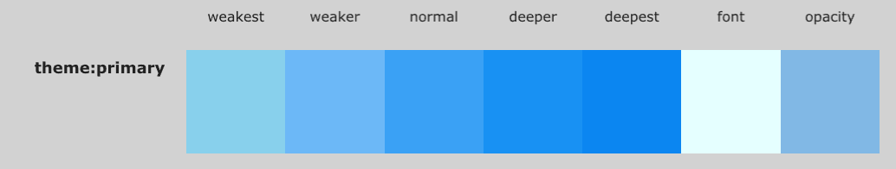
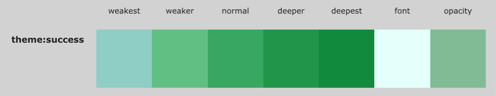
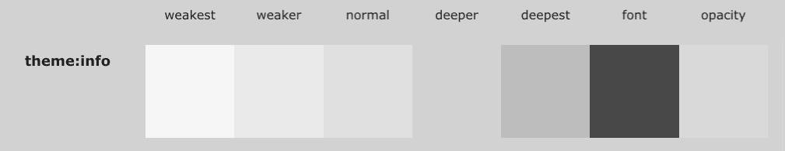
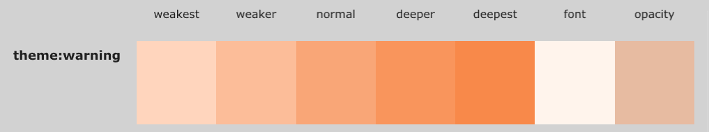
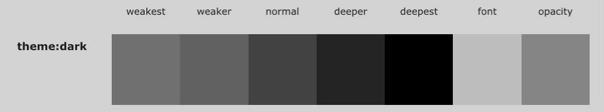
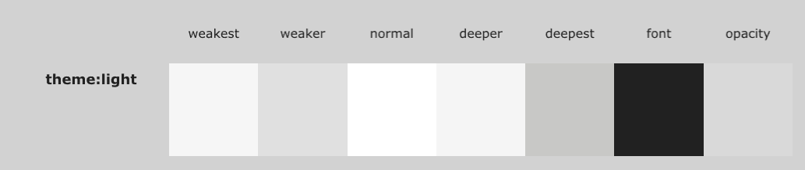

  

# SurrealismUI

- author：syf20020816@outlook.com
- createDate：20230908
- updateDate：20231224
- version：0.3.0
- email：syf20020816@outlook.com


**SurrealismUI是一个完全使用Slint进行构建的Slint第三方组件库**

**SurrealismUI is a third-party component library built entirely using Slint**

## Install 

### use Slimk

### Github

## QuickStart


## Themes

Built in 7 theme colors in SurrealismUI

- primary
- success
- info
- warning
- error
- dark 
- light

### themes-color

```
			  default
————————————————————————————————————
|  logic control layer (Rust|C++)  |
————————————————————————————————————
				⇕
————————————————————————————————————
|    UI layer (write components)   |
————————————————————————————————————

		   SurrealismUI
————————————————————————————————————
|  logic control layer (Rust|C++)  |
————————————————————————————————————
				⇕
————————————————————————————————————
|      UI Styles Wrapper layer     |   <-- What SurrealismUI do , see ①
————————————————————————————————————
|   UI layer (write components)    |
————————————————————————————————————

①：define a lot replaceable theme styles and binding styles use theme property , can be customized in slint file or logic control layer , means: all system components are wrapped (Customizing themes in third-party component libraries is very affordable as it acts on the UI layer. slint is like an integration of HTML and CSS, so I use this way)(By binding global singleton variables to styles, any component that uses variables can change styles simultaneously)

				System support (like iced)
————————————————————————————————————      ————————————————
|           logic control          | -->  | Theme::Light |
————————————————————————————————————      ————————————————
|             UI layer             |     		  ↓
———————————————————————————————————— 	    |————————————|
						 ↑			     ↓            ↓
				import	  ← Light_Theme Styles   Dark_Theme Styles

## Diff
Slint differs from other GUI frameworks in that the UI layer is completed through. slint, which I believe is good and brings many advantages (compatibility with different platforms, instant preview, maintainability, parallel development, etc.). But this also leads to SLIT being unable to easily customize the theme of the component. Theme customization and switching are dynamic to static processes, which require a lot of logical processing, and this is also same as (HTML+CSS+js | ts)
```


#### primary



#### success



#### info



#### warning



#### error


#### dark



#### light



## Components

-  SText ：It is the simplest and most common component in SurrealismUI
-  SButton ：SButton is a button component that you can freely perform regular attribute operations on
-  SIcon ：this is a icon container ,  better than Image
-  SInput ：This is a basic input box, often used in forms, divided into two types: text and password
-  SCard ：A very simple universal card without any layout or restrictions ， you can add anything you want to the card
-  SStar ： SStar is a scoring component
-  SSelect ：SSelect is a selector that provides three types of optional input parameter values
-  STag ：A small tag used to display data
-  SHeader ：SHeader is a simple header component that is generated based on routing information
-  STable ：This is the outter of the Table, and the column data of the table is separated from the outter . The outter only serves as a standard layout , this is a zero cost construction
-  STableColumn ：STableColumn is a component of STable, and each STableColumn forms a complete column of the table . If it's gone, the table will become a card with a horizontal layout
-  SCollapse ：SCollapse is a foldable panel. This is the outter of the Collapse, what really works is SCollapseItem. The outter only serves as a standard layout , this is a zero cost construction
-  SCollapseItem ：SCollapseItem is a component of SCollapse, without which SCollapse will not work , You can customize the components or use the default text display method in it
-  SResult ：SResult helps you easily build a quick prompt , you can build it in popup window
-  SAvatar ：SAvatar is a avatar component that defaults to Icons.Avatar when there are no images available
-  SLink ：SLink is commonly used to represent text connections or sharing
-  SDivider ：A divider groups sections of content to create visual rhythm and hierarchy. Use dividers along with spacing and headers to organize content in your layout. 
-  SPopup ：A masked pop-up layer appears in the current window . And users will not be able to use the pop-up layer to cover the components under it. Clicking on the pop-up layer again will close it
-  SCollection ：SCollection is an expandable box that can be zoomed in or out by clicking (internal can also be used)
-  SRadio ：Radio let people select a single item
-  SBadge ：SBadge is a quick way to display user status or events
-  SPersona ：This component is used to display simple user introduction information
-  SProgress ：SProgress is commonly used to display download progress or event processing progress . And you can fully control it through the progress property
-  STip ：A tip provides supplemental, contextual information elevated near its target component
-  SLoading ： This is a loading component that you can embed anywhere you want to add a loading animation 
-  SDialog ：SDialogs are used to confirm messages or events and display text
-  SMenu ：SMenu is a menu bar located on the left side that you can quickly generate through the menu-data property
-  SSwitch ：SSwitch is a switch used for simple judgment scenarios
-  SDrawer ：Sometimes, the Dialogue component does not meet our needs , such as your form being too long, or if you need to temporarily display some documents, please use the SDrawer
-  SAlert ：SAlert is used to display important prompt information on the page
-  SSwitchGroup ：SSwitchGroup switch group can contain more switch cases
-  STree ：STree can be used to display directory structure, forming a parent-child relationship, and can be easily displayed
-  SFile ：SFile can help users present file selectors GUI

## Updates

- V0.3.0 (Slint 1.3.2)
  - 中文
    - 所有组件更名`SUR`为`S`
    - 默认文字采用`Arial`
    - 重写所有组件 (`SMenu` 除外)
    - 重构`themes/index.slint`（用于导出内置Schema，内置Global）
    - 增加use方式导出内置方法，内置结构体，内置枚举等
    - 使用use方式对组件进行插槽预备
    - 修改内置主题色
    - 重构项目结构
  - English
    - Renaming all components from `SUR` to `S`
    - Default text adopts `Arial`
    - Rewrite all components（except `SMenu`）
    - Refactoring `themes/index. slint` (used to export built-in schemas, built-in Global)
    - Add use mode to export built-in functions, built-in struct, built-in enum, etc
    - Prepare slots for components using the use method
    - Modify built-in theme colors
    - Refactoring project structure
- V0.2.2（Slint 1.3.0）
  - 中文：
    - 优化内置Global：
      - 修复标准内置方法：`get-padding()`
      - 增加`PaddingType Enum`类型`PaddingType.Tag`
      - 增加标准内置方法`get-color()`
      - 增加标准内置枚举`ColorLevel`
    - 优化`SText`
      - 修改属性名`content -> text`
    - 优化`STag`：
      - 修复`STag`样式异常
      - `STag` remove content property , please use text (as Builtin `Text`)
      - `callback clicked(string)`增加返回参数(`tag text`)
    - 优化`SIcon`
      - 修改属性名`icon -> source`
      - 移除`get-icon()`
    - 优化`SButton`
      - 增加`show-icon`属性控制是否加载图片
      - 修复按钮异常
      - 修改属性名`content -> text`
    - 优化`SLink`
      - 修改属性名`content -> text`
      - `callback clicked(string)`增加返回参数(`link text`)
      - 增加hover控制下划线触发效果
      - 增加`underline`属性控制下划线显示
    - 修复`SURAvatar`默认Icon消失问题
  - English
    - Optimize built-in Global:
      - Fix standard built-in methods: ` get padding ()`
      - Add `PaddingType Enum` type `PaddingType.Tag`
      - Add Standard Built-in Method ` get color()`
      - Add Standard Built-in Enumeration ` ColorLevel`
    - Optimize ` SText`
      - Modify Attribute Name ` content ->text`
    - Optimize `STag`:
      - Fix `STag` style anomalies
      - `STag` remove content property, please use text (as Built in `Text`)
      - `callback clicked (string)` Add return parameter (`tag text`)
    - Optimize ` SIcon`
      - Modify Attribute Name ` icon ->source`
      - Remove ` get icon ()`
    - Optimize ` SButton`
      - Add the `show icon` attribute to control whether to load images
      - Fix button error
      - Modify Attribute Name ` content ->text`
    - Optimize ` SLink`
      - Modify Attribute Name ` content ->text`
      - `callback clicked (string)` Add return parameters (`link text`)
      - Add hover control underline trigger effect
      - Add the `underline` attribute to control the display of underscores
    - Fix the issue of `SURAvatar` default Icon disappearing

- V0.2.1
  - add `STree`
  - add `SFile`

- V0.2.0
  - add `SSwitchOption`
  - add `SSwitchGroup`
  - optimize `SInput`

- V0.1.7
  - add `SSwitch`
  - add `SDrawer`
  - add `SAlert`

- V0.1.6
  - solve `SLoading` animation!

- V0.1.5
  - add `SMenu`
  - enhance `STip` (the location of the tip can be changed now  and you can show it with hover ! )

- V0.1.4
  - add `STip`
  - add `SLoading`
  - add `SDialog`

- V0.1.3
  - add `SBadge`
  - add `Progress`
  - add `Persona`
- V0.1.2
  - rebuild components (have `SIcon`)
  - rebuild `SIcon`
  - rebuild file structure
  - solve memery overflow issue
  - use minimize import principle (remove inner loop to judge component show!)❗
  - test use Rust✅
- V0.1.1
  - add `SRadio`
  - add `SDivider`
  - add `SCollection`
  - add `SPopup`
- V0.1.0
  - Adopting Fluent2's component design style
  - Multiple default methods are provided for consumers to call (see index.slint which on the outermost side)
  - Decoupling functions and components
  - Fix some style errors
  - add `SLink` and `SURAvatar`
